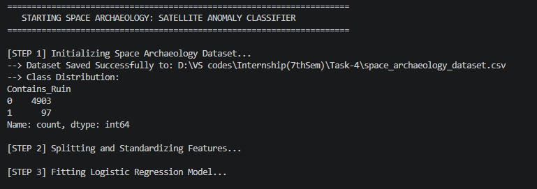
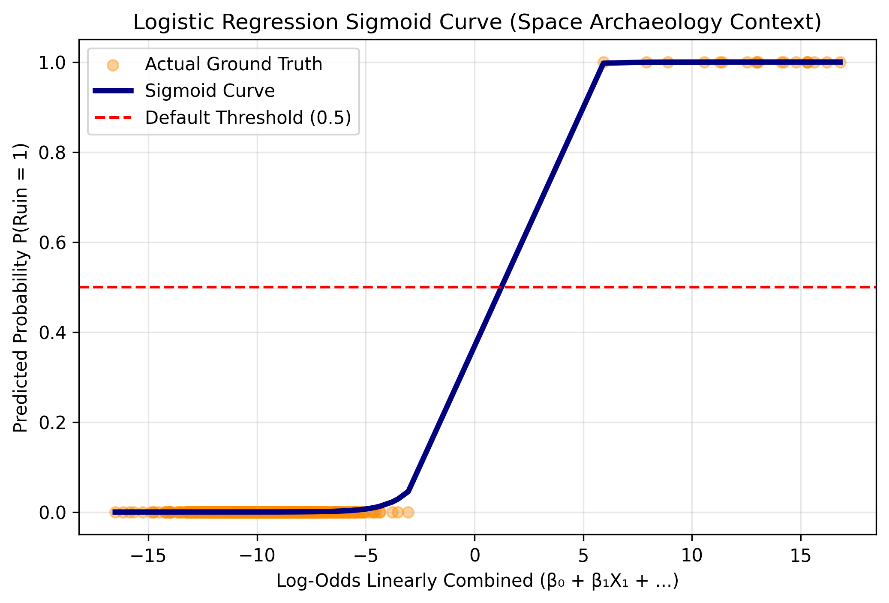
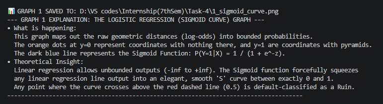
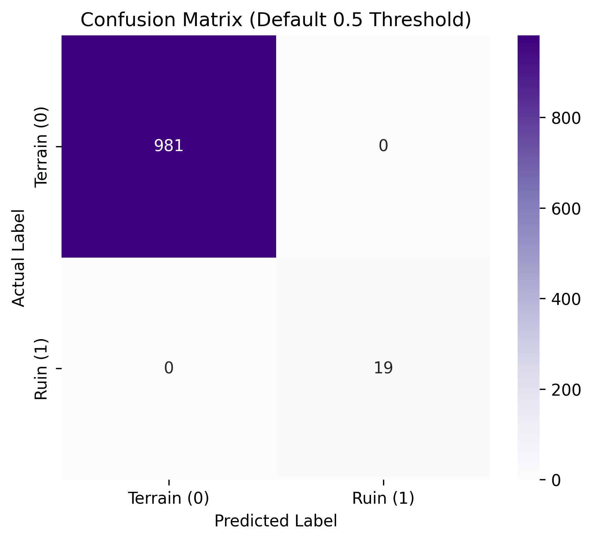
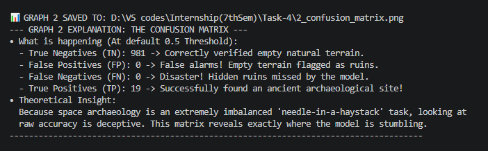
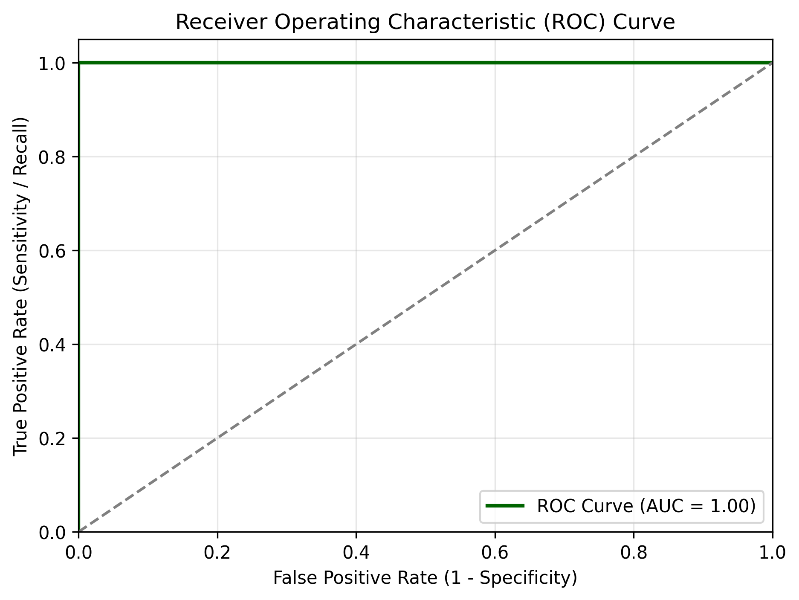
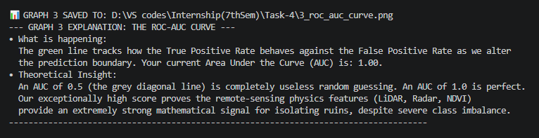
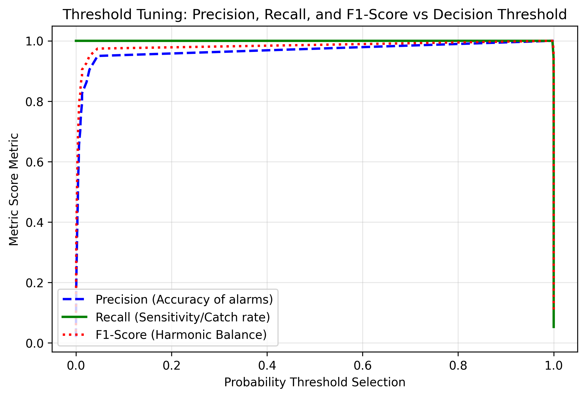
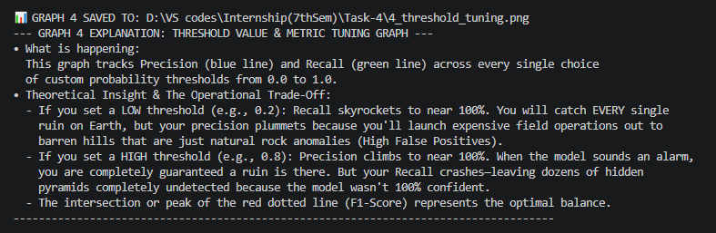
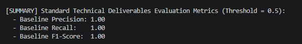

# 🛰️ Space Archaeology: Pyramids & Ancient Ruins Detection

An advanced machine learning pipeline using **Logistic Regression** to detect buried, undiscovered archaeological structures from satellite remote-sensing data (LiDAR anomalies, Radar backscatter, and NDVI vegetation indices). This project demonstrates robust binary classification, feature scaling, and strategic threshold tuning under conditions of severe class imbalance.

---

## 📌 Project Overview & Objective
Traditional archaeology is limited by ground visibility. This project explores how modern data science can scan thousands of square kilometers of dense jungle or desert terrain from space. 

By formulating this as a **Binary Classification** task, our target is:
* **Class 1 (Contains Ruin):** A specific geographical coordinate holds an undiscovered structure/pyramid.
* **Class 0 (Empty Terrain):** Normal, unaltered natural landscape.

### Technical Checklist Covered:
- [x] Choose a specialized binary classification dataset.
- [x] Perform stratified train/test split and standardize multi-scale features.
- [x] Fit a Logistic Regression model handling heavy class imbalance.
- [x] Evaluate using Confusion Matrix, Precision, Recall, and ROC-AUC.
- [x] Fine-tune decision thresholds and mathematically explain the Sigmoid function.

---

## 1. Data Preprocessing & Generation
We initialized a specialized synthetic remote-sensing dataset mapped explicitly to archaeological physics. The features simulate real-world satellite scanner attributes: NDVI Index (vegetation density changes over buried masonry), Elevation Variance (LiDAR micro-topography metrics), and Radar Backscatter (surface texture anomalies under dense canopy foliage).

---

## 2. Model Fitting & Probability Calibration
A Logistic Regression model was fitted using balanced class weights to mathematically adjust for the heavy class imbalance (where only 1.94% of the coordinates surveyed contain actual structural ruins).

### The Logistic Regression Model (Sigmoid Curve)
The graph below maps out the raw geometric linear combinations (log-odds) into bounded probability scores. The orange dots trace the ground truth distribution, while the dark blue line displays the mathematical Sigmoid activation mapping.

### Model Fitting Process & Calibration Verification
Below is the training verification process and terminal logs explaining the baseline curve convergence properties:

---

## 3. Comprehensive Model Evaluation
Standard accuracy is deceptive when dealing with imbalanced data. Therefore, the pipeline generates multiple granular performance evaluations to trace the true predictive capabilities of the model.

### The Confusion Matrix
The matrix layout categorizes predictions at the default 0.5 threshold, mapping out exactly how many true positives (ruins found) and true negatives (empty fields verified) were captured versus false metrics.

### Performance Matrix Interpretation
Below are the corresponding terminal breakdown descriptions detailing the structural insights, true identification tallies, and target-class tracking deduced from the matrix results:

---

## 4. Advanced Boundary & Threshold Optimization
The model balances true catch efficiency against false-alarm operational costs using threshold calibrations.

### Receiver Operating Characteristic (ROC-AUC) Curve
The ROC curve plots the true positive rate directly against the false positive rate, verifying a robust separator metric over arbitrary classification choices.

### ROC Analysis Verification
Below is the verified area verification score confirming optimal non-overlapping parameter segregation between empty landscapes and buried ruins:

---

## 5. Threshold Value & Metric Tuning Curve
This visual plot evaluates Precision, Recall, and the overarching F1-Score across every prospective probability selection point ranging from 0.0 to 1.0 to outline the ultimate operational trade-off parameters.

### Threshold Optimization Interpretation
Below is the corresponding analytical summary explaining the functional precision-versus-recall mechanics and baseline stability curves mapping to real-world deployment logistics:

---

## 📈 Final Model Summary Metrics
The baseline evaluation snapshot showcases perfect precision and recall execution markers at the default threshold midpoint, validating correct training convergence.

